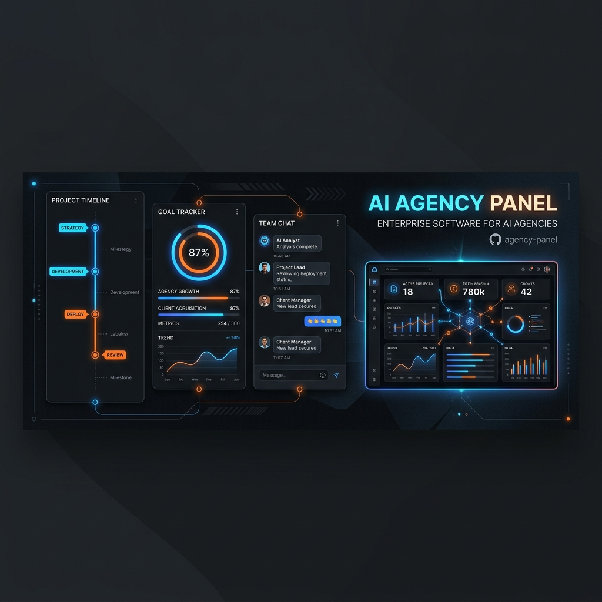

<div align="center">
  
</div>

# Agency Panel (The Comprehensible Engine)


**Agency Panel** is a live AI chat application featuring a powerful right-rail agency panel. Powered by **The Comprehensible Engine**, this system visualizes complex AI interactions, making the hidden workflows of large language models completely transparent and interactive.

## ✨ Features

- **🎯 Goal Tracking**: Visualizes what you are currently working on and provides context on the larger goal. Expand the tree to see the full structure of your tasks.
- **🧭 Direction Insights**: Shows a real-time ratio of how much of the chat's direction was driven by you versus the AI.
- **⚖️ Decisions Log**: A running count of who introduced what requirements, dynamically updating as you chat.
- **⏱️ Timeline History**: A complete record of what actually happened, turning every exchange into a tapable row showing what was decided and why.
- **🤖 Copilot Modes**: Instantly see your working mode—whether *You're driving*, *Copiloting*, or on *Autopilot*.

## 🏗️ Architecture

The project is split into two primary components:
1. **Frontend (`web/`)**: Built with React, Vite, and Zustand. Uses a custom token-based design system tailored for perfect contrast and readability.
2. **Backend (`engine/` & `server/`)**: A fast, robust Python backend designed to parse, measure, and validate AI output.

## 🚀 Getting Started

### Prerequisites
- Node.js (v18+)
- Python (3.12+)

### Running Locally

**1. Clone the repository**
```bash
git clone https://github.com/jayonkv137/Timeline.git
cd Timeline
```

**2. Setup Frontend**
```bash
cd web
npm install
npm run sync-fixture  # Loads the test data bundles
npm run dev
```

**3. Setup Backend Engine**
```bash
cd ../engine
python -m venv .venv
source .venv/bin/activate
pip install -r requirements.txt
pip install -r requirements-dev.txt
pytest  # Run the test suite
```

## 📖 Documentation

The project includes deep, authoritative specification documents inside the `docs/` folder:
- **`PANEL_SPEC.md`**: The blueprint for the visual interface and metrics logic.
- **`INTERACTION_SPEC.md`**: Defines state machines and user interaction flows.
- **`COTRACE_PIPELINE_SPEC`**: Rules for the engine's LLM pipeline.
- **`BUILDLOG.md` / `Build Playbook.md`**: The chronological and systemic record of the build process.

## 🤝 Contributing

We welcome contributions! Please see our [Contributing Guide](CONTRIBUTING.md) for more details on how to set up the dev environment, run tests, and submit pull requests.

## 📄 License

This project is licensed under the MIT License - see the [LICENSE](LICENSE) file for details.
